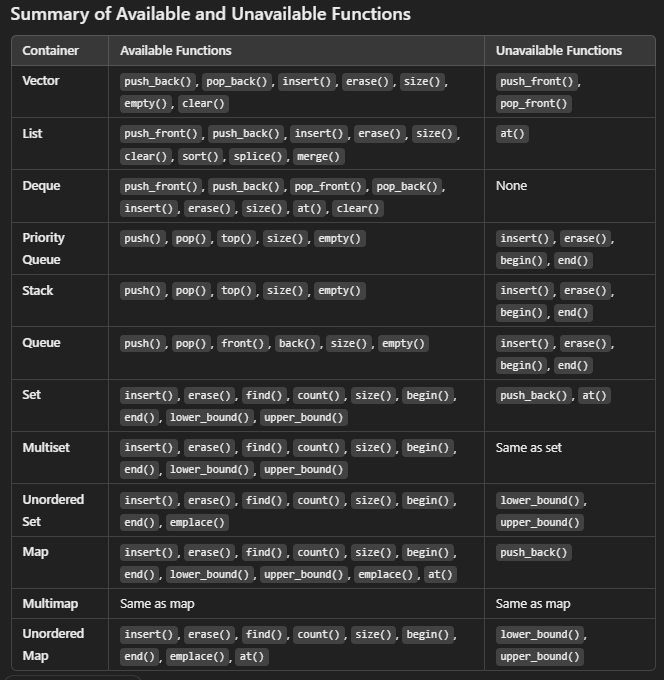

### 1. **Core STL Containers**:
   - **Sequential Containers**: 
     - `vector`, `deque`, `list`
   - **Associative Containers**:
     - `set`, `multiset`, `map`, `multimap`
   - **Unordered Containers** (Hash-based):
     - `unordered_set`, `unordered_multiset`, `unordered_map`, `unordered_multimap`
   - **Container Adaptors**: 
     - `stack`, `queue`, `priority_queue`
   
### 2. **Key Functions**:
   - **Insertions and Deletions**:
     - `insert()`, `push_back()`, `push_front()`, `erase()`, `pop_back()`, `pop_front()`
   - **Access**:
     - `at()`, `front()`, `back()`
   - **Lookup**:
     - `find()`, `count()`, `lower_bound()`, `upper_bound()`, `equal_range()`
   - **Capacity**:
     - `size()`, `empty()`, `clear()`
   - **Sorting and Merging** (specific containers):
     - `sort()`, `splice()`, `merge()`
   - **Priority Queues**:
     - Min-Heap or Max-Heap with `priority_queue` (with custom comparator)
   
### 3. **STL Algorithms** (Important to be familiar with):
   STL also offers algorithms that work on containers, which you should be comfortable with:
   - **Sorting**: `sort()`, `partial_sort()`
   - **Searching**: `binary_search()`, `find()`, `lower_bound()`, `upper_bound()`
   - **Modifying**: `reverse()`, `rotate()`, `unique()`
   - **Set Operations**: `set_union()`, `set_intersection()`, `set_difference()`
   - **Other Utilities**: `min()`, `max()`, `swap()`, `accumulate()`
   
### 4. **Iterators** (A key part of STL):
   Iterators are used to traverse through containers and work with algorithms:
   - `begin()`, `end()`, `rbegin()`, `rend()`, `cbegin()`, `cend()`
   - Types of iterators: **input, output, forward, bidirectional, random access**

### 5. **Custom Comparators and Functors**:
   - To customize sorting or priority queues, you need to know how to write custom comparators or functors.
   - Example: You used a **min-heap** with `priority_queue`, which is a good example of this.

### 6. **Exception Handling** (Edge Cases):
   - Methods like `at()` throw exceptions on out-of-bound access.
   - Be aware of memory management (especially for large containers), and know when operations are **O(1)** vs **O(n)**.

### What's Next?
If you've covered these areas, you're in excellent shape for understanding the STL. The key is **practice**! Try to solve problems that require you to choose the right container and utilize the STL effectively. Here are a few more advanced STL topics you could explore once you're comfortable:
   
1. **Lambda Functions**: Useful when paired with STL algorithms like `sort()`, `for_each()`, etc.
2. **Emplace vs Insert**: For performance tuning (like `emplace()` for inserting objects in-place without unnecessary copies).
3. **Complex Operations**: Like finding intersections, subsets, or range queries using appropriate containers like `set` or `map`.
4. **Memory Considerations**: Working with smart pointers and ensuring you optimize memory when using large STL containers.

---

### Final Tips:
- **Work on problems**: Platforms like LeetCode, Codeforces, or HackerRank often have problems that test your understanding of STL.
- **Understand complexity**: Knowing the time complexity of each container operation is crucial when choosing the right data structure for a problem.
